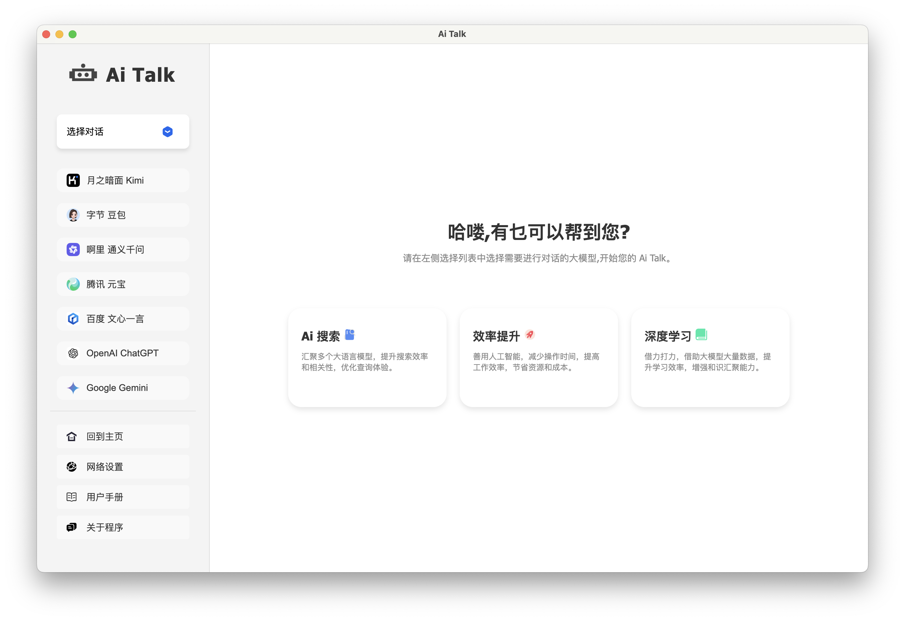
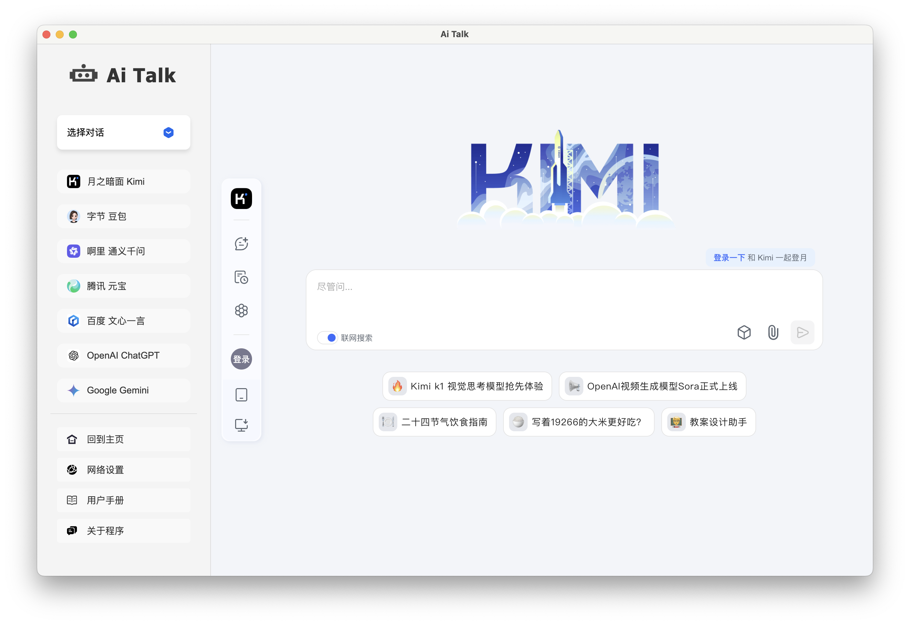
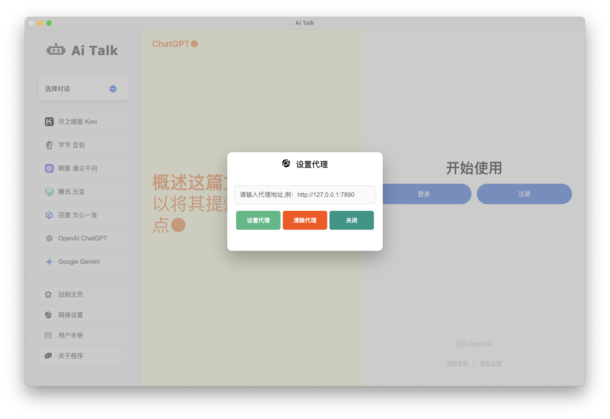
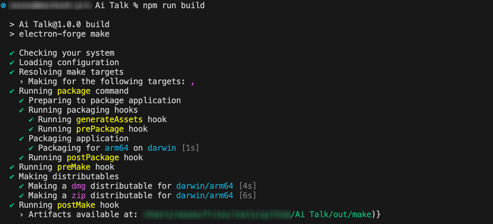

#  Ai Talk


<p align="left">
  
  
  
  
  
</p>

## 📔 简介

**Ai Talk** 是一款集合了多种大语言模型应用的开源桌面客户端，基于 Electron 构建。当前支持以下大模型：OpenAI ChatGPT、Google Gemini、Quora Poe、Anthropic Claude、深度求索 DeepSeek、月之暗面 Kimi、字节 豆包、阿里 通义千问、腾讯 元宝、百度 文心一言。 [[English Readme\]](https://github.com/Funsiooo/Ai-Talk/doc/README_EN.md)

<br/>

> 📑   **Note：** OpenAi ChatGPT、Google Gemini 、Quora Poe 、Claude 需要设置网络代理才能正常访问。


<br/>

## 📟 功能介绍

**界面：** 程序主要由两部分组成：左侧的侧边栏和右侧的显示区域。点击左侧的某个大模型，右侧将加载该大模型的官方页面，即可开始对话。





**网络代理：** 由于 **OpenAI ChatGPT** 、 **Google Gemini** 、**Quora Poe** 模型需要访问国外网站，因此在使用之前，需要在左侧侧边栏下方的 “网络设置” 中配置代理网络。目前只支持 **HTTP** 和 **HTTPS** 协议。配置步骤如下：


> - 点击 “网络设置” ，在弹窗输入代理地址，如：本地开启了 7890 端口为代理网络端口，填入 http://127.0.0.1:7890 
> - 点击 “设置代理” ，完成网络设置
> - 如网络设置输入错误，点击 “清除代理” 即可恢复程序默认设置
> - 设置完毕后点击 “关闭” 



## 📸 大模型使用规则

> 深度求索 DeepSeek

消息条数限制：免费使用，不限次数。


> 月之暗面 Kimi

消息条数限制：免费使用，不限次数。


> 通义千问

消息条数限制：免费使用，不限次数。


> 字节 豆包

消息条数限制：免费使用，不限次数。


> 腾讯 元宝

消息条数限制：免费使用，不限次数。


> 百度 文心一言

消息条数限制：3.5 模型免费使用，其它模型存在次数限制。


> OpenAi ChatGPT

消息条数限制：免费套餐用户在 5 小时内只能使用 GPT-4o 的有限次数，使用完毕回退其它模型，如：GPT-3.5 。【 官方文档链接：https://help.openai.com/en/articles/9275245-using-chatgpt-s-free-tier-faq#h_43513320b9】


> Google  Gemini

消息条数限制：1.5 flash 免费使用，存在次数限额，限额不详。【官方文档：https://gemini.google.com/faq】


> Quora Poe

消息条数限制：存在次数限额，限额不详。


<br/>

## ⌨️ 源码启动

- 安装 nodejs

```
https://nodejs.org/zh-cn/download
```

- 下载项目源码

```
git clone https://github.com/Funsiooo/Ai-Talk.git
```

- 安装 electron

```
cd Ai-Talk
npm install electron --save-dev -d --registry=https://registry.npmmirror.com
```


- Ai Talk 目录下执行

```
npm start
```

<br/>


## 📦 打包

- 安装 node.js

```
https://nodejs.org/zh-cn/download
```

- 下载项目源码

```
git clone https://github.com/Funsiooo/Ai-Talk.git
```

- 安装 electron

```
cd Ai-Talk
npm install electron --save-dev -d --registry=https://registry.npmmirror.com
```


- 安装 electron-forge/cli

```
npm install --save-dev @electron-forge/cli -d --registry=https://registry.npmmirror.com
```

- macos 安装 @electron-forge/maker-dmg

```
npm install --save-dev  -d @electron-forge/maker-dmg --registry=https://registry.npmmirror.com
```

- Ai Talk 目录下执行，打包文件存放在 out 目录下（打包过程中若出现报错可忽略）

```
npm run build
```
> 📑   **Note：** 自行打包需要根据自身设备替换项目中的 package.json 文件, 目前提供 **Mac Apple silicon**、**Windows** 打包文件, 文件见 config 文件夹。



<br/>

## ☕ 请作者喝杯咖啡

如果你觉得本项⽬帮助了你，不妨考虑请作者喝⼀杯咖啡！


