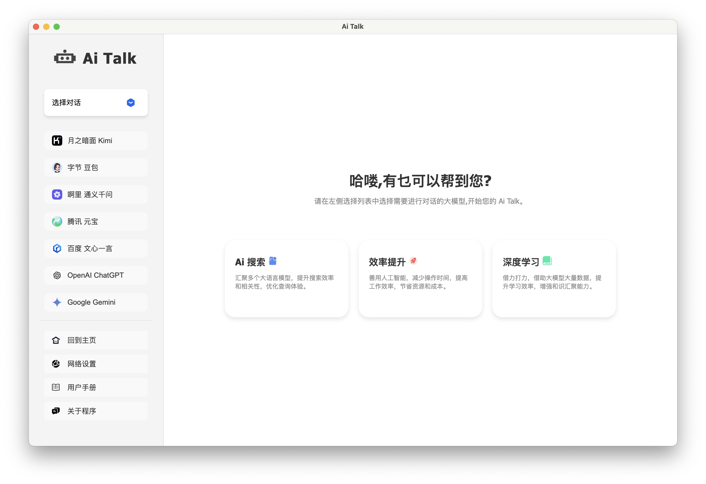
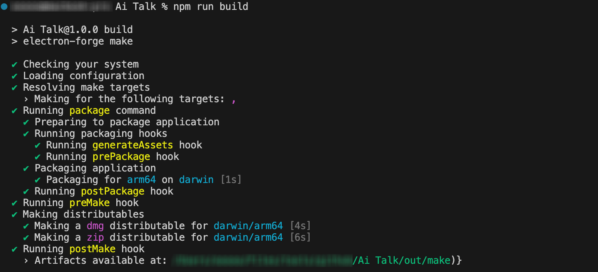

#  Ai Talk


<p align="left">
  
  
  
  
  
</p>

## 📔 Introduction

**Ai Talk** is an open source desktop client that integrates a variety of large language model applications and is built on Electron. Currently supports the following large models: OpenAI ChatGPT、Google Gemini、Quora Poe、Anthropic  Claude、Moonshot Kimi、Douyin DouBao、ShenduQiusuo DeepSeek、Alibaba Cloud Qwen、Tencent yuanbao、Baidu WenXinYiYan。  [[Chinese Readme\]](./README.md)

<br/>


## 📟 Program Introduction

**Interface:** The program mainly consists of two parts: the sidebar on the left and the display area on the right. Click on a large model on the left, and the official page of the large model will be loaded on the right, and you can start the conversation.




**Network Proxy:** Currently only supports **HTTP** and **HTTPS** protocols. The configuration steps are as follows:


> - Click "网络设置" and enter the proxy address in the pop-up window. For example, if port 7890 is enabled locally as the proxy network port, enter http://127.0.0.1:7890
> - Click "设置代理" to complete the network settings
> - If the network settings are entered incorrectly, click "清除网络" to restore the program default settings
> - Click "关闭" after setting.


## 📸 Rules for using large models

> Shendu Qiusuo DeepSeek

Message limit: Free to use, unlimited number of times.


> Moonshot Kimi

Message limit: Free to use, unlimited number of times.


> Alibaba Cloud Qwen

Message limit: Free to use, unlimited number of times.


> TikTok DouBao

Message limit: Free to use, unlimited number of times.


> Tencent yuanbao

Message limit: Free to use, unlimited number of times.


> Baidu WenXinYiYan

Message limit: 3.5 models are free to use, other models have a limit on the number of times.


> OpenAi ChatGPT

Message limit: Free tier users can only use GPT-4o a limited number of times within 5 hours, and after use, they can fall back to other models, such as GPT-3.5. [Official document link: https://help.openai.com/en/articles/9275245-using-chatgpt-s-free-tier-faq#h_43513320b9]


> Google  Gemini

Message limit: 1.5 flash is free to use, but there is a limit on the number of messages, which is unknown. [Official document: https://gemini.google.com/faq]


> Quora Poe

Message limit: There is a limit on the number of messages, but the limit is unknown.

<br/>

## ⌨️ Source code startup

- Install nodejs

```
https://nodejs.org/zh-cn/download
```

- Download project source code

```
git clone https://github.com/Funsiooo/Ai-Talk.git
```

- Install electron

```
cd Ai-Talk
npm install electron --save-dev -d --registry=https://registry.npmmirror.com
```


- Execute in Ai Talk directory

```
npm start
```

<br/>


## 📦 To package

- Install node.js

```
https://nodejs.org/zh-cn/download
```

- Download project source code

```
git clone https://github.com/Funsiooo/Ai-Talk.git
```

- Install electron

```
cd Ai-Talk
npm install electron --save-dev -d --registry=https://registry.npmmirror.com
```


- Install electron-forge/cli

```
npm install --save-dev @electron-forge/cli -d --registry=https://registry.npmmirror.com
```

- macos install @electron-forge/maker-dmg

```
npm install --save-dev  -d @electron-forge/maker-dmg --registry=https://registry.npmmirror.com
```

- Execute in the Ai Talk directory, and the packaged files are stored in the out directory (if errors occur during the packaging process, they can be ignored)

```
npm run build
```
> 📑   **Note：** To package by yourself, you need to replace the package.json file in the project according to your own device. Currently, **Mac Apple silicon** and **Windows** packaging files are provided. The files can be found in the config folder.



<br/>

## ☕ Buy me a Coffee

If you feel that this project has helped you, please consider buying the author a cup of coffee!


